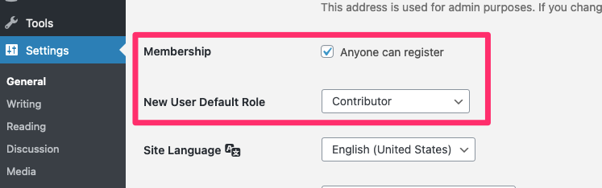
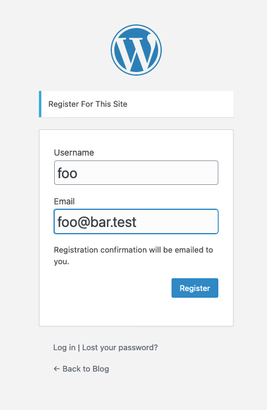
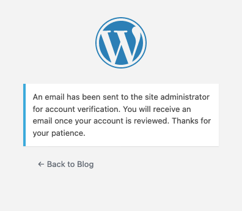
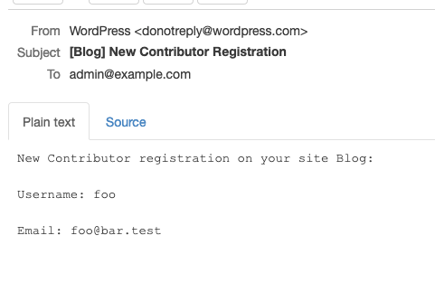
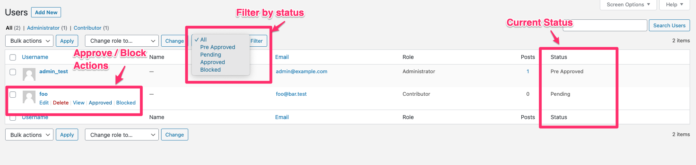
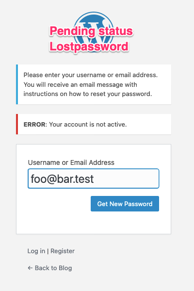
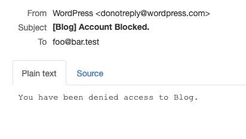
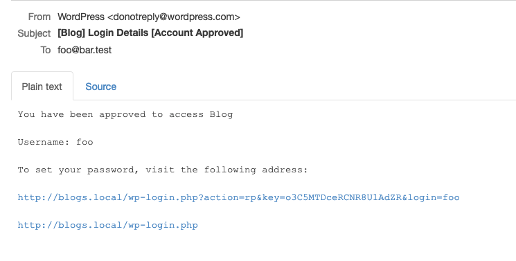

User Approval
======================

  

Approval/block user account for new registered users based on default user role.

### WorkFlow

- Enable User Approve Plugin.
- Enable User registration with default User role from WP from General -> Settings.

  `

- Register user on WordPress will now see a message to wait for apporval.

  `

  `

- Admin will now get a mail for registered user.

  `

- Admin will see new user detail in users list screen with Approve/Block Action link and current status as pending.

  `

- Until new user account gets approve by admin, user won't be able to login or generate password.

  `

- Once admin approve or block user account, user will get a mail with respective action message.

  `

- User will get a password reset/generate link once account is approved, and now they can login normally.

  `

#### Filters:

- `user_approval_registered_user_message`: Update message shown on user registration form.
- `user_approval_new_user_admin_email_data`: Update email subject + body message for new registered user.
- `user_approval_approved_user_email_data`: Update email subject + body message for mail sent to user on account approval.
- `user_approval_blocked_user_email_data`: Update email subject + body message for mail sent to user on account blocked.
- `user_approval_default_user_role`: Update default user role.
